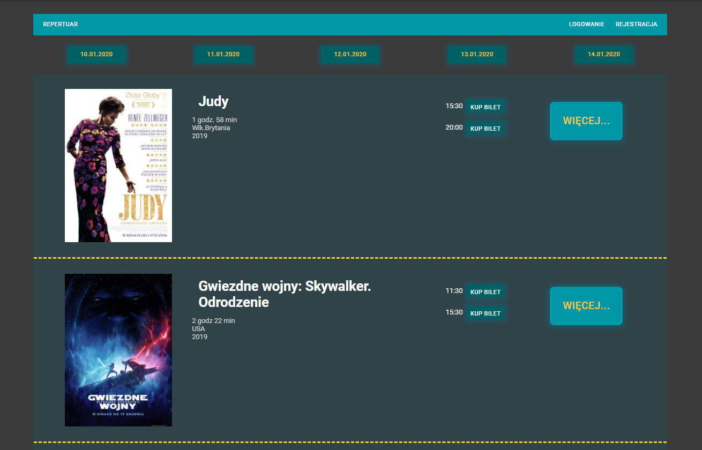

# booking-tickets
React frontend for app to booking tickets.
Project made during [CodersCamp](https://coderscamp.edu.pl/) course.

## Installation

1. Clone or download the repo
2. Download, install and run [MongoDB Community Server](https://www.mongodb.com/what-is-mongodb)
3. Open folder /server
4. Assuming that you have at least Node 10 LTS installed, use npm to install: `npm install`
5. Once the installation is done, you can run the project: `npm start`
6. Open [POSTMAN](https://www.getpostman.com/) and create request: POST "http://localhost:9090/api/movie/create", click `send`.
7. Check using MongoCompass if database with movies is created.
8. Open folder /client
9. Open another commandline, use npm to install: `npm install`
10. Once the installation is done, you can run the project: `npm start`
11. Open http://localhost:3000/ to view in the browser.
